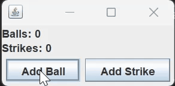

# HWLinearLightsOut

## Overview:
- This exercise will provide more practice with event based programming and Java Swing.
- This assignment is broken into two parts; an individual and paired part (details are below).
### Documentation requirements
**For all files you modify in this project**, you must provide Javadocs.
- Use the provided *BankAccount.java* file for guidance with class-level Javadocs and method-level Javadocs.
- Use standard java comments for parts of your code whose functionality is non-obvious. 
(If a grader needs to debug your code, it's a good idea to make it as easy for them as possible.)
- Give self-documenting variable and method names.

## Part 1 - To be done individually

### Overview
This is designed to prepare you for part 2 of this assignment. You will create a program to count "balls" and "strikes" in a 
baseball game.

### Part 1 TODO
- Make the Ball and Add Strike buttons appear in the app's window as shown in the GIF below.
- Add labels above the buttons as shown in the GIF below.
- The buttons must work as follows: 
    - The *Add Ball* button, when clicked adds a 1 to the Balls count label. If the count in the Balls count label ever reaches 4, then both the Balls count and Strikes count labels must be reset to 0.
    - The *Add Strike* button, when clicked adds 1 to the Strikes count label. If the count in the Strikes count label ever reaches 3, then both the Balls count and Strikes count labels must be reset to 0.
    - The labels should be updated to reflect the new ball/strike counts every time a button is clicked.
 

 

### Rubric
This part of the assignment is worth 40.0 points. You will receive deductions for the following:
| Item                                          | Point Value   |
|-----------------------------------------------|---------------|
| No help citation                              | -1.0 pts      |
| Insufficient documentation                    | -1.0 pts      |
| No Javadocs                                   | -2.0 pts      |
| Improper scaling/formatting of window         | -3.0 pts      |
| Number of strikes or balls is incorrect       | -5.0 pts      |
| Incorrect output upon pushing buttons         | -10.0 pts     |
| Strike button is nonfunctional or not present | -15.0 pts     |
| Ball button is nonfunctional or not present   | -15.0 pts     |
| Missing count                                 | -20.0  pts     |

## Part 2 - To be done in pairs

### Overview
The goal of this assignment is to create a program that follows the following specifications:
- The app presents the user with an array of buttons. Each button has a 50% chance of displaying either an X or an O.
- Clicking on a button changes the symbol of the clicked-on button and *both its left and right neighbors*, if those neighbors exist.
- When all the buttons display the same symbol, the player wins and the game is over. The program will notify the user by changing the title of the window to "We have a winner!"

### Part 2 TODO
1. Examine the main method in the LinearMain class in the linearLightsOut package in the LinearLightsOut project that you checked out in class. This is all the code that we supply for the project: the rest is your responsibility
1. Display a frame in a window with the title "Linear Lights Out!"
1. Create the buttons and display the correct number in the frame you created in the previous step (see nButtons). There is no need to worry about event handling yet. *For full credit, your solution must work with any value of nButtons greater than two.*
1. Make sure the buttons are initialized to random symbols (Xs and Os, 50% probability for each).
1. Implement a working Quit button (This involves implementing an event handler for the Quit button).
1. Implement a working New Game button. When the button it pressed, the game should reset the symbol buttons to a new set of random symbols.
1. Set up event handlers for the symbol buttons that correctly toggle the symbols as described above.
1. Check for a win and notify the player by changing the title of the window. Make sure to change the window title back when the player presses new game.

 

### Rubric
This part of the assignment is worth 75.0 points. Except for academic dishonesty, you cannot get a negative score. You will receive deductions for the following:
| Documentation Error                         | Points Deducted |
|---------------------------------------------|-----------------|
| Adequate documentation                      | 0 pts           |
| No help citation                            | -1 pts        |
| No Javadocs                                 | -2 pts          |

| Functionality Error                         | Points Deducted |
|---------------------------------------------|-----------------|
| Everything functions properly              | 0 pts           |
| Only the button labels should change when clicking the new game button (should not prompt for number of buttons) | -5 pts |
| Title does not reset when clicking the new game button | -5 pts |
| Window does not match the format from the image above | -5 pts |
| Window does not scale properly (consider using the pack() method on your frame) | -10 pts |
| Winning the game does not notify the player | -10 pts |
| Buttons do not display when the game is first started | -10 pts |
| Win condition does not work for all X's and all O's | -15 pts |
| Win message shown under the wrong conditions | -15 pts |
| New game button does not function properly or is not present | -15 pts |
| Quit button does not function properly or is not present | -15 pts |
| Buttons are not changed properly            | -20 pts         |
| Win condition never calculated              | -20 pts         |
| Game uses a predefined number of buttons (no prompt for setting button amount) | -40 pts |
| X and O buttons do not change symbols when clicked | -40 pts |
| App does not function as intended           | -75 pts         |

### Collaboration Rules
- You may work with a single classmate of your choosing on this part.
- You may sit together while you work and discuss ideas and code freely, but each person must type and upload their own files to the assignment's dropbox.
- We highly recommend that you seek out a partner to collaborate on this part of the assignment.
    - Why? Because you will be working on a multi-week project with at least 1 partner toward the end of this quarter. Now is a good time to find someone you can work with
- **If you do work with a partner, each partner must identify the other in a comment at the top of your program.**

### Hints:
1. *JButton*'s *setText()* and *getText()* methods are your friends, use them
2. You do not need to use inheritance to solve this problem
3. You may, however, use inheritance in this project if you wish: extending JFrame, JButton, and/or JPanel, for example
4. Correct ALL compiler warnings - those warnings are telling you that something is incorrect about your code
5. For proper scaling, consider using the pack() method.

